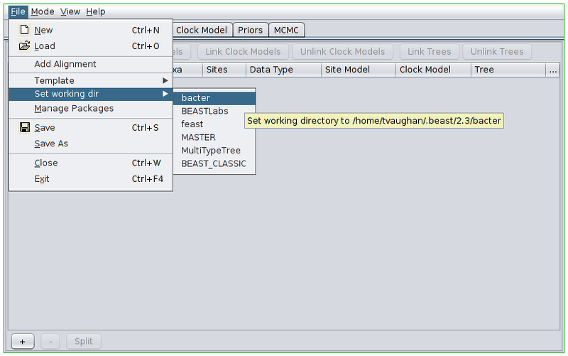
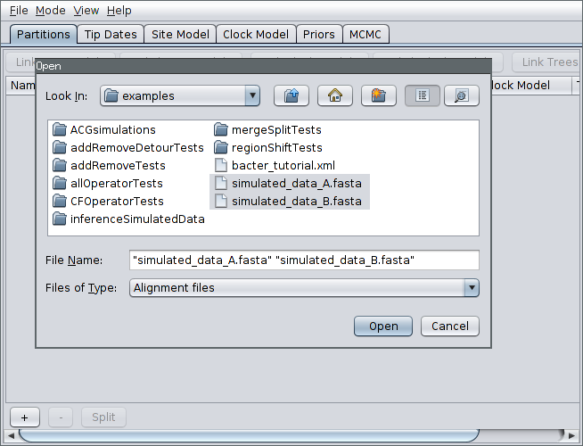
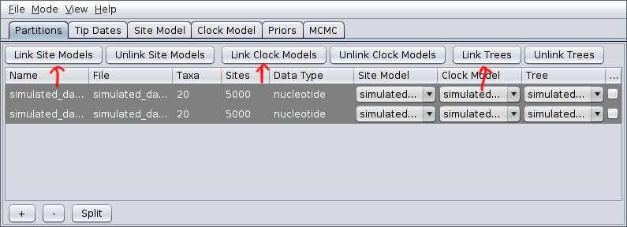
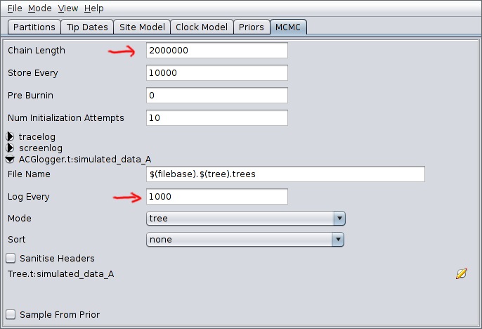
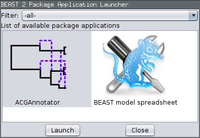
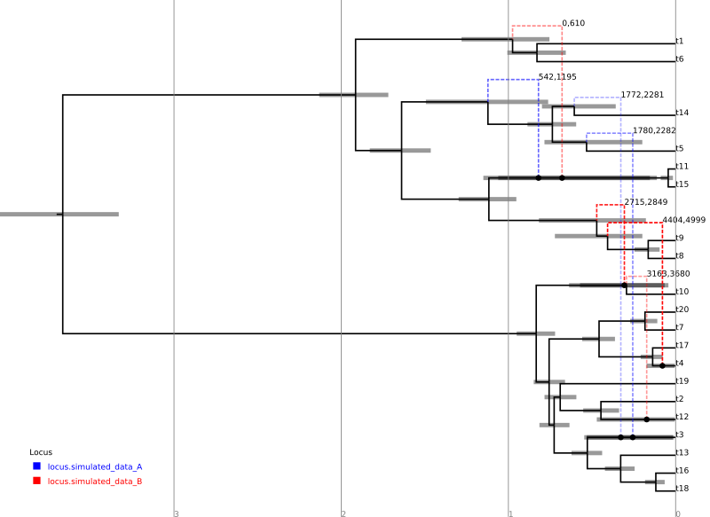

Tutorial: Basic Analysis
========================

This tutorial will gently walk you through the process of using Bacter,
from to jointly infer an ARG and population model parameters from an
example multi-locus data set.

Choosing the Bacter BEAUti template
-----------------------------------

Open the BEAUti program. Before doing anything else we must switch to
the Bacter template. To do this, open the file menu and from the
Template submenu select "Bacter".

{:.img-responsive}

Loading an alignment
--------------------

Once the appropriate template is set, we can load our sequence data. In
this tutorial we will be performing an inference based on simulated data
that is distributed with Bacter. To load this data, first change
BEAUti's working directory to that of the installed bacter package by
selecting File-&gt;Set working dir-&gt;bacter. (This step is **only**
useful when loading data/XMLs distributed with packages.)

{:.img-responsive}

Then, select File-&gt;Add Alignment, navigate to the examples/
subdirectory. Hold down the Ctrl key (or Command if you're on a Mac) and
click to select the two files simulated\_data\_A.fasta and
simulated\_data\_B.fasta.

{:.img-responsive}

Each of these files is a simulated alignment of 20 distinct 5kb
nucleotide sequences. Each file contains the multiple sequence alignment
for a distinct locus. That is, each file contains exactly the same
number of sequences from the same sampled bacteria but from different
portions of the genome.

After pressing Open, the alignments should be visible as two new records
in the table. By default, each locus is assumed to have its own distinct
site, clock and "tree" (really ARG here) models. Since our ARGs
potentially span multiple loci, we should definitely cause the loci to
share a tree model. This is done by selecting both rows in the table by
again holding down Ctrl (or Command) and clicking each in turn.
Alternatively, you can just click on one row and then press Ctrl+A.
(This is easier than clicking each row if your data consists of many
loci.) Once they're selected, press the "Link Trees" button on the
right-hand side just above the table. In our case, we will use shared
site and clock models too, so click the "Link Site Models" and "Link
Clock Models" buttons as well.

{:.img-responsive}

Setting up the analysis
-----------------------

We will now configure the model under which the inference will be
conducted.

The simulated data that we've loaded was sampled contemporaneously. We
can therefore ignore the Tip Dates panel. When analyzing real data where
the samples were collected at very different times you'll want to
include those times in the analysis by modifying the contents of that
panel.

Furthermore, the data was simulated using a simple Jukes-Cantor
substitution model, which is the default configuration given in the Site
Model panel. When analyzing real data, you will likely want to use a
more sophisticated substitution model.

Open the Clock Model panel and set the clock rate to the true value of
0.005. (We cannot estimate this parameter without serially sampled
sequence data.)

{:.img-responsive}

Now switch to the Priors panel. As we suspect that population which gave
rise to our data was growing exponentially, select "Coalescent
Exponential Population" from the drop-down list of ARG priors. Expand
the tree prior by clicking on the arrow to the left of "Tree.t".

Un-check the "estimate" checkboxes to the right of the recombination
rate (Rho) and tract length (Delta) parameters and enter the values
1.0e-4 and 500.0 respectively. Estimating these parameters can actually
be quite difficult, so fixing them to known values is a good idea if
these are available.

Select log normal priors for the population growth rate and final size
parameters, with parameters M=0 and S=2.

The priors panel should now look similar to the following:

{:.img-responsive}

Finally, switch to the MCMC panel and change the chain length to
2000000. This is almost certainly far too short for a production run,
but means that the example analysis will complete relatively quickly.
Also, because our run is so short, we'll sample the chain of ARGs more
frequently. To do this, expand the ACGLogger.t:simulated\_data\_A
section by clicking on the arrow to the left of this line, then set the
"Log Every" field to 1000. The MCMC panel should now look similar to the
following:

{:.img-responsive}

Once your analysis is set up, select File-&gt;Save, navigate to the
directory you wish the analysis XML to be written to, give it a sensible
file name (for example bacter\_tutorial.xml), and press the Save button
to produce the BEAST input XML.

Running the analysis
--------------------

Run the analysis just as you would any other BEAST 2 analysis. That is,

1.  Start BEAST 2.
2.  Select the XML you produced in the previous section from the file
    selection dialog box.

Once BEAST is running, you should see output periodically printed to
standard out (if you're running BEAST from a terminal emulator) or the
output window. The analysis we've set up should take around half an hour
to complete on a modern computer.

Analyzing the results
---------------------

During the analysis results are written to several files which can
usually located in the same directory as the directory containing the
input XML. These are:

1.  The **log** file, which ends in the extension .log and contains
    sampled parameter values,
2.  The **tree** file, which ends in the extension .trees and contains
    sampled ARGs.

### Parameter posteriors

To examine the sampled parameter posteriors, open Tracer and load the
log file. In our example analysis, the main parameters we're interested
in are the population growth rate and final size. The data were
simulated under an exponential growth model with rate 0.5 (per unit
time) and final effective size 5.0. Both these values are well within
the 95% HPD intervals for the corresponding inferred parameters:

{:.img-responsive}

Note that the ESS for many parameters, the likelihood in particular, is
still extremely small. This indicates that, as anticipated, the chain
should be run for a lot longer before the results are considered
trustworthy. We can easily continue/resume the chain just as for any
other BEAST 2 analysis, and you may wish to try this yourself. However,
in the interests of keeping the length of time needed to complete this
tutorial from becoming too long, we will now proceed to further analyse
the results we already have.

### Viewing sampled ARGs

The ARGs sampled during a Bacter analysis can be viewed using the
browser-based [IcyTree](http://tgvaughan.github.io/icytree) phylogenetic
tree and network visualizer. Beware that the viewer requires an up-to-date
version of Firefox or Chrome to function correctly.

To use the viewer, simply open the
[IcyTree](http://tgvaughan.github.io/icytree) web page in a browser
window, select File-&gt;"Load from file", then choose the tree file
using the file chooser. Alternatively, you can simply drag the tree file
onto the IcyTree window.

Once loaded, the first ARG in the tree file is displayed. Use the comma
and period (, and .) keys to step through the file one ARG at a time or
the &lt; and &gt; keys to step in increments of 10%. Navigation can also
be performed by clicking on the buttons in the lower-left corner of the
window with your mouse. Further information about using IcyTree can be
found by selecting items listed under the Help menu. To generate the
image below, edges were coloured by locus (Style-&gt;"Colour edges by"),
the colouring legend and the time axis were switched on
(Style-&gt;"Display legend" and Style-&gt;"Display axis").

{:.img-responsive}

ARGs are displayed in IcyTree in a particular way. The solid lines
depict lineages belonging to the clonal frame, while dashed edges
representing the topology changes imposed on the clonal frame by
conversions. Additional information concerning a specific edge can be
viewed by hovering the mouse cursor over that edge.

It is important to remember that ARGs at the start of the file
(particularly the first) will likely be very different to the true ARG,
as this portion of the file represents ARGs sampled before convergence
of the MCMC to the true posterior. Later trees should represent
individual samples drawn from the posterior.

### Creating a summary ARG

Individual ARGs sampled from the posterior are poor representations of
the inference result at best, and at worst they may be completely
misleading. This is because they contain no indication in the
uncertainty inherent in what the sequence data tells us of the events
they describe. Thus, while a single ARG sample may contain features that
are well-supported by the data, the same ARG will likely contain many
features that have little or no support at all.

What is needed is some kind of picture of the posterior \_distribution\_
over ARG space instead of a single point estimate. Unfortunately, the
optimal route to producing such a summary is currently an open research
question. However, Bacter provides an implementation of an algorithm for
constructing a qualitative summary which is similar in spirit to the
algorithms which BEAST and other Bayesian phylogenetic packages use to
summarize distributions over tree space.

To produce a summary ARG, open the "AppStore" program that is
distributed with BEAST 2.

{:.img-responsive}

Ensure the ACGAnnotator icon is highlighted, then press the Launch button.
This will open a dialog from which you can select the ACG (tree) log
file and the name and location of the file to which the summary is
written. In addition, you can adjust:

1.  The burn-in percentage: the percentage of the tree log file which
    will be ignored to account for the samples that were taken before
    the MCMC reached convergence.
2.  The position summary method: this affects the way that the internal
    node ages of the summary tree are chosen. The default is to use the
    mean of the node ages present in the sampled ARGs.
3.  The posterior conversion support threshold: this is the percentage
    of sampled ARGs which must contain a given conversion for it to be
    included in the summary tree. (This is conceptually similar to the
    threshold for clade inclusion in a majority-rule consensus tree.)

For this tutorial, ensure the ACG (tree) log file generated by the above
analysis is selected and choose summary.tree as the output file name.
Leave the burn-in fraction at 10% and keep MEAN as the position summary
method, but lower the conversion support threshold to 30%. This means
that conversions will only have to appear in 30% of the sampled ARGs to
be included in the summary. The dialog should now look like the
following image:

{:.img-responsive}

Pressing the "Analyze" button will bring up an additional window which
will report on the progress of creating the summary tree. As there are
only a few hundred ARGs present in our log file, this process should
only take a few seconds. Once it is complete, press the Close button.
You can also exit the AppStore.

Loading the file summary.tree in IcyTree should produce something
similar to the following figure. (Edges have been coloured by "locus",
the opacity of recombinant edges indicates their posterior support and
they have been labelled with the sites affected by the corresponding
conversion. Error bars indicating the node age 95% HPD intervals have
also been included.)

{:.img-responsive}

For comparison, the following depicts the true ARG that was used to
produce the simulated data:

{:.img-responsive}

Although the inference has recovered many features of the true ARG,
fewer features appear in the summary than were present in reality. This
is a side-effect of the summary procedure, which includes only those
features that have adequate support. Features in the original which did
not produce a strong signal in the data do not appear in the summary. In
addition, since the chain has not completely converged to the true
posterior, running the algorithm for more steps will no-doubt recover a
greater fraction of the conversions.

In addition, notice the pair of low-support conversions between the
clonal frame edges above leaf nodes t3 and t5/t14. These edges
correspond to almost precisely the same sites on locus A. These two
conversions actually represent uncertainty in the source edge of a
single conversion coming from either t5 or t14 to arrive at t3. (From
the true ARG we see that the fragment actually comes from t5.) It is
important to be aware of this artifact of the summary procedure. Even if
a single connection point of a recombinant edge is known with a high
degree of confidence, uncertainty in the location of the other point may
cause the conversion to appear as a number of lower-support edges.

Wrapping up
-----------

This completes the first tutorial. In a future tutorial we will
demonstrate how to use Bacter to perform non-parametric inference of
population dynamics (Bayesian Skyline Plots from ARGs).
