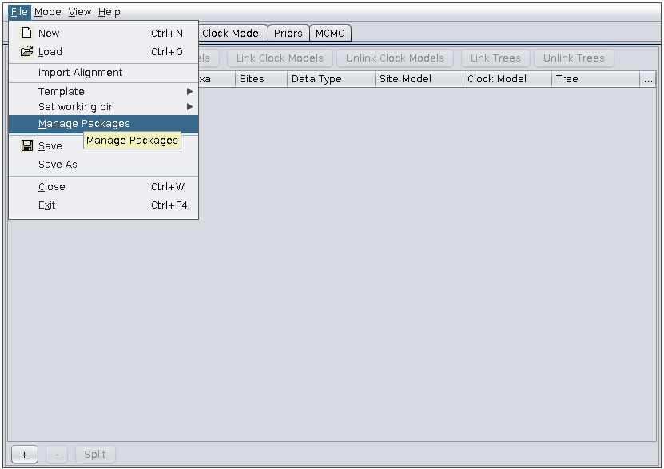
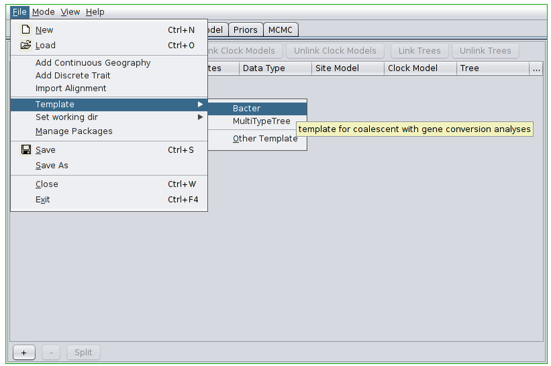
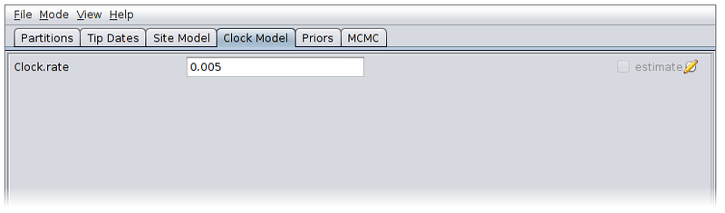
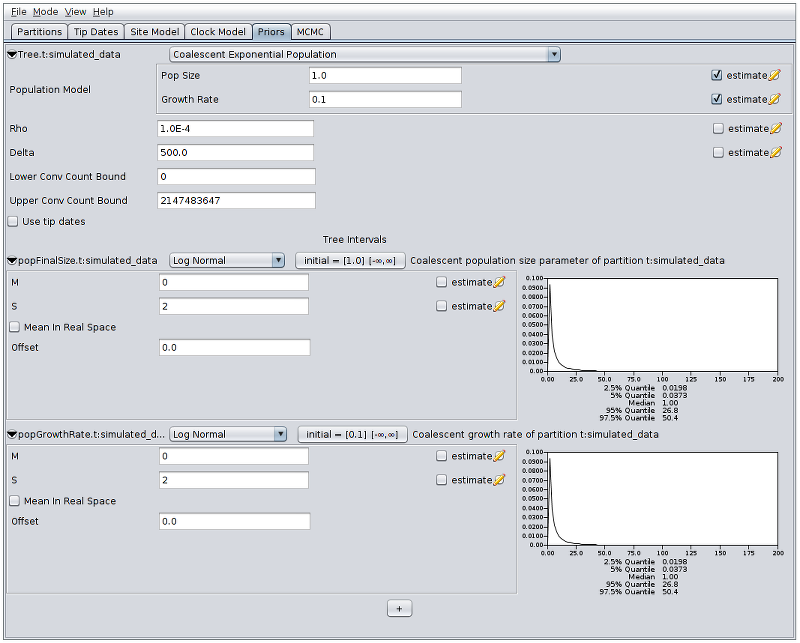
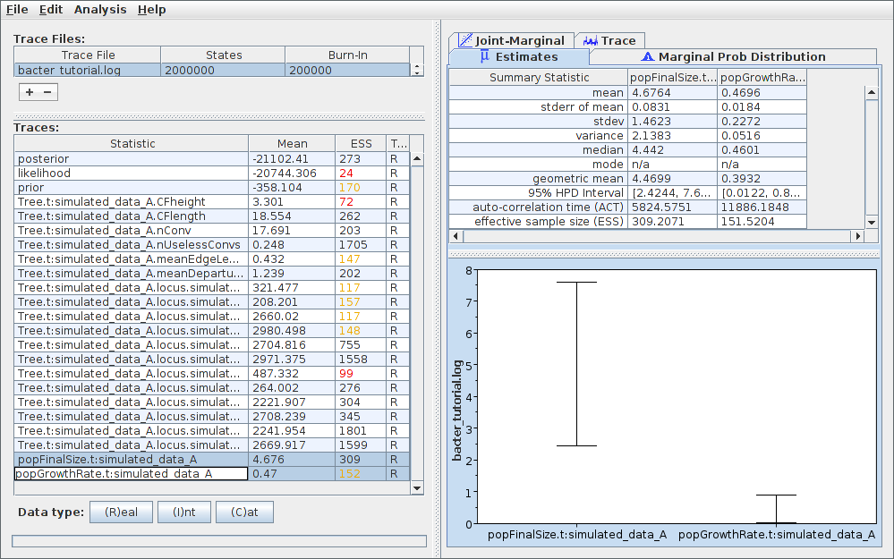
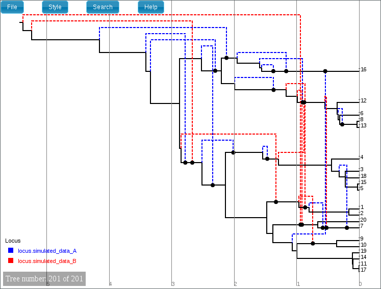
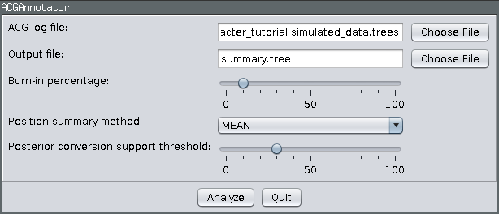
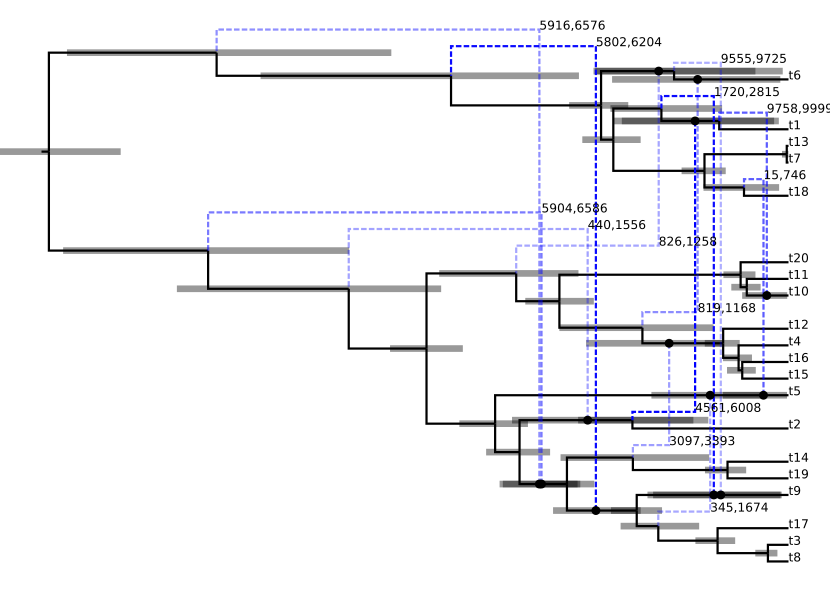
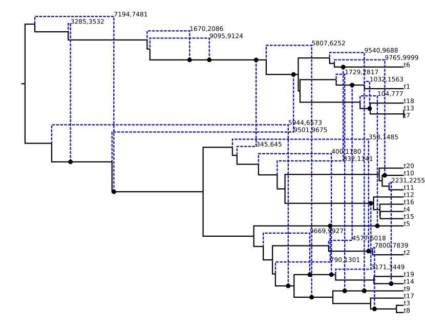

***************
Bacter Tutorial
***************

Introduction
============

`Bacter`_ is a `BEAST 2`_ package dedicated to performing inference of bacterial
sequence data.  In general, it allows for joint inference of the Ancestral
Recombination Graph (ARG), recombination rates, tract lengths, substitution
rate and population dynamics.  Exactly what may be inferred from a given data
set depends heavily on the size of the data set, and the rates of recombination
and mutation for the population under study, and the sampling procedure.

This tutorial will gently walk you through the process of using Bacter, from
installation of the package through to jointly inferring an ARG and population
model parameters from an example data set.

.. _Bacter: http://tgvaughan.github.io/bacter
.. _BEAST 2: http://www.beast2.org/

Software requirements
=====================

In order to use Bacter and complete this tutorial the following software must
be installed:

* BEAST 2 version 2.3.1 or later. http://www.beast2.org/
* Tracer version 1.6 or later. http://tree.bio.ed.ac.uk/software/tracer/
* A recent version of `Mozilla Firefox`_ or `Google Chrome`_.

.. _Mozilla Firefox: http://www.mozilla.org/firefox
.. _Google Chrome: http://www.google.com/chrome

Installation
============

Bacter is easily installed via the BEAUti package manager.  To do this, run
BEAUti and select "Manage Packages" from the File menu:

Then, ensure the "bacter" package is highlighted before pressing the
"Install/Upgrade" button:

.. image:: images/package_manager.png

That's it!  Bacter is now installed.  It is a good idea to restart BEAUti at
this point.

Choosing the Bacter BEAUti template
===================================

Once BEAUti is open, the first thing that must be done is to switch to the
Bacter template.  To do this, open the file menu and from the Template submenu
select "Bacter".

Loading an alignment
====================

Once the appropriate template is set, we can load our sequence data.  In this tutorial
we will be performing an inference based on simulated data that is distributed with
Bacter.  To load this data, first change BEAUti's working directory to that of the
installed bacter package by selecting File->Set working dir->bacter.  (This step is
**only** useful when loading data/XMLs distributed with packages.)

.. image:: images/setwd.png

Then, select File->Add Alignment, navigate to the :file:`examples/` subdirectory and
choose the file :file:`simulated_data.fasta`.  This is a simulated alignment of 20
distinct 10kb nucleotide sequences.  The alignment should now be visible as a
new record in the table.

Setting up the analysis
=======================

We will now configure the model under which the inference will be conducted.

The simulated data that we've loaded was sampled contemporaneously. We can
therefore ignore the Tip Dates panel.  When analyzing real data where the
samples were collected at very different times you'll want to include those
times in the analysis by modifying the contents of that panel.

Furthermore, the data was simulated using a simple Jukes-Cantor substitution
model, which is the default configuration given in the Site Model panel. When
analyzing real data, you will likely want to use a more sophisticated
substitution model.

Open the Clock Model panel and set the clock rate to the true value of 0.005.
(We cannot estimate this parameter without serially sampled sequence data.)

Now switch to the Priors panel.  As we suspect that population which gave rise
to our data was growing exponentially, select "Coalescent Exponential
Population" from the drop-down list of ARG priors.  Expand the tree prior by
clicking on the arrow to the left of "Tree.t".

Un-check the "estimate" checkboxes to the right of the recombination rate (Rho)
and tract length (Delta) parameters and enter the values 1.0e-4 and 500.0
respectively.  Estimating these parameters can actually be quite difficult, so
fixing them to known values is a good idea if these are available.

Select log normal priors for the population growth rate and final size
parameters, with parameters M=0 and S=2.

The priors panel should now look similar to the following:

Finally, switch to the MCMC panel and change the chain length to 2000000.

Once your analysis is set up, select File->Save, navigate to the directory you
wish the analysis XML to be written to, give it a sensible file name (for
example :file:`bacter_tutorial.xml`), and press the Save button to produce the BEAST
input XML.

Running the analysis
====================

Run the analysis just as you would any other BEAST 2 analysis.  That is,

1. Start BEAST 2.
2. Select the XML you produced in the previous section from the file selection dialog box.

Once BEAST is running, you should see output periodically printed to standard
out (if you're running BEAST from a terminal emulator) or the output window.
The analysis we've set up should take just under an hour to complete on a
modern computer.

Analyzing the results
=====================

During the analysis results are written to several files which can usually
located in the same directory as the directory containin the input XML.  These are:

1. The **log** file, which ends in the extension :file:`.log` and contains sampled parameter values,
2. The **tree** file, which ends in the extension :file:`.trees` and contains sampled ARGs.

Parameter posteriors
--------------------

To examine the sampled parameter posteriors, open Tracer and load the log file.
In our example analysis, the main parameters we're interested in are the
population growth rate and final size.  The data were simulated under an
exponential growth model with rate 0.5 (per unit time) and final effective size
5.0.  Both these values are well within the 95% HPD intervals for the
corresponding inferred parameters:

Note that the ESS for the likelihood is still quite small.  This indicates that
the chain should probably be run for a while longer before the results are
considered completely trustworthy.

Viewing sampled ARGs
--------------------

The ARGs sampled during a Bacter analysis can be viewed using browser-based
`IcyTree`_ phylogenetic tree and network viewer. Betware that the viewer
requires an up-to-date version of Firefox or Chrome to function correctly.

To use the viewer, simply open the `IcyTree`_ web page in a browser window,
select File->Load from file, then choose the tree file using the file chooser.
Alternatively, you can simply drag the tree file onto the IcyTree window.

Once loaded, the first ARG in the tree file is displayed.  Use the comma and
period (:kbd:`,` and :kbd:`.`) keys to step through the file one ARG at a time
or the :kbd:`<` and :kbd:`>` keys to step in increments of 10%.  Navigation can
also be performed by clicking on the buttons in the lower-left corner of the
window with your mouse.  Further information about using IcyTree can be found
by selecting items listed under the Help menu.

.. _IcyTree: http://tgvaughan.github.io/icytree

ARGs are displayed in IcyTree in a particular way.  The solid lines depict
lineages belonging to the clonal frame, while dashed edges representing the
topology changes imposed on the clonal frame by conversions.

It is important to remember that ARGs at the start of the file (particularly
the first) will likely be very different to the true ARG, as this portion of
the file represents ARGs sampled before convergence of the MCMC to the true
posterior. Later trees should represent individual samples drawn from the
posterior.

Creating a summary ARG
----------------------

Individual ARGs sampled from the posterior are poor representations of the
inference result at best, and at worst they may be completely misleading.  This
is because they contain no indication in the uncertainty inherent in what the
sequence data tells us of the events they describe.  Thus, while a single ARG
sample may contain features that are well-supported by the data, the same ARG
will likeliy contain many features that have little or no support at all.

What is needed is some kind of picture of the posterior _distribution_ over ARG
space instead of a single point estimate.  Unfortunately, the optimal route to
producing such a summary is currently an open research question.  However,
Bacter provides an implementation of an algorithm for constructing a
qualitative summary which is similar in spirit to the algorithms which BEAST
and other Bayesian phylogenetic packages use to summarize distributions over
tree space.

To produce a summary ARG, open the "AppStore" program that is distributed with BEAST 2.

.. image:: images/appstore.png

Ensure the ACGAnnotator icon is hilighted, then press the Launch button.  This
will open a dialog from which you can select the ACG (tree) log file and the
name and location of the file to which the summary is written.  In addition, you can adjust:

1.  The burn-in percentage:  the percentage of the tree log file which will be
    ignored to account for the samples that were taken before the MCMC reached
    convergence.

2. The position summary method: this affects the way that the internal node
   ages of the summary tree are chosen.  The default is to use the mean of the
   node ages present in the sampled ARGs.

3. The posterior conversion support threshold: this is the percentage of
   sampled ARGs which must contain a given conversion for it to be included in
   the summary tree.  (This is conceptually similar to the threshold for clade
   inclusion in a majority-rule consensus tree.)

For this tutorial, ensure the ACG (tree) log file generated by the above
analysis is selected and choose :file:`summary.tree` as the output file name.  Leave
the burn-in fraction at 10% and keep MEAN as the position summary method.
Lower the conversion support threshold down to around 30%.  The dialog should
now look like the following image:

Pressing the "Analyze" button will bring up an additional window which will report
on the progress of creating the summary tree.  As there are only a few hundred
ARGs present in our log file, this process should only take a few seconds.
Once it is complete, press the Close button.  You can also exit the AppStore.

Loading the file :file:`summary.tree` in IcyTree should produce something similar to
the following figure.  (Edges have been coloured by "locus", the opacity of
recombinant edges indicates their posterior support and they have been labelled
with the sites affected by the corresponding conversion. Error bars indicating
the node age 95% HPD intervals have also been included.)

For comparison, the following depicts the true ARG that was used to produce the
simulated data:

Although the inference has
recovered many features of the true ARG, fewer features appear in the summary
than were present in reality.  This is a side-effect of the summary procedure,
which includes only those features that have adequate support.  Features in
the original which did not produce a strong signal in the data do not appear
in the summary.

Wrapping up
===========

In this tutorial we have demonstrated some of the basic functionality of
Bacter.  However, this is not a complete overview.  Topics which have been
omitted from this tutorial include:

1. conversion rate and expected tract length inference,
2. non-parametric inference of population dynamics (Bayesian Skyline Plots from ARGs),
3. dealing with multi-locus data sets.

These topics will be covered by future tutorials.
